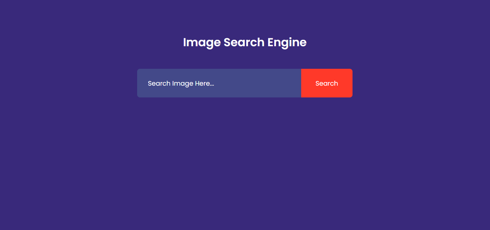
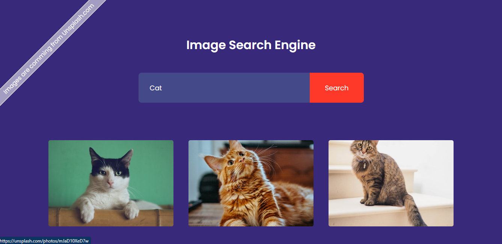
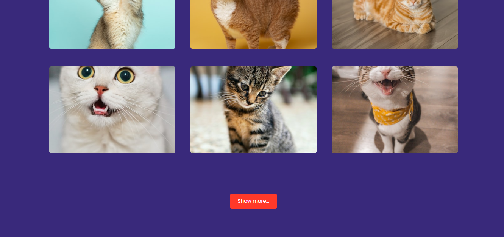

# Image Search Engine

The "Image Search Engine" project allows users to search for images by entering keywords in the search box. The search results are displayed dynamically on the page. Users can also click on the "Show more..." button to load additional search results.


## Getting Started

Clone the repository or download the project files.
Open the index.html file in a web browser.

```bash
  git clone https://github.com/DeepakKumarVermaRamgarh/ImageSearchEngine
```
    
## Features

The "Image Search Engine" project allows users to search for images by entering keywords in the search box.


## Usage/Examples

- Enter a keyword in the search box.
- Click the "Search" button or press Enter.
- The search results will be displayed below the search box.
- Click the "Show more..." button to load additional search results.


## Roadmap

Here is a brief overview of each file in the repository:

- index.html - This file contains the HTML code for the project.

- styles.css - This file contains the CSS code that styles the project.

- script.js - This file contains the JavaScript code.

- README.md - This file provides instructions on how to run the project.
## Authors

This project was created by Deepak Kumar Verma.
- [@DeepakKumarVermaRamgarh](https://github.com/DeepakKumarVermaRamgarh/)


## Screenshots



